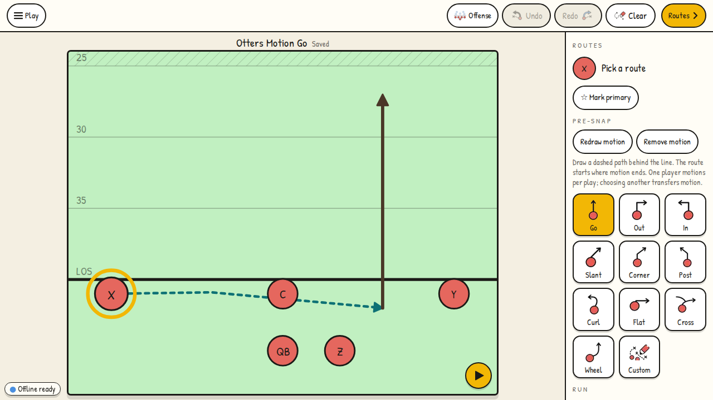
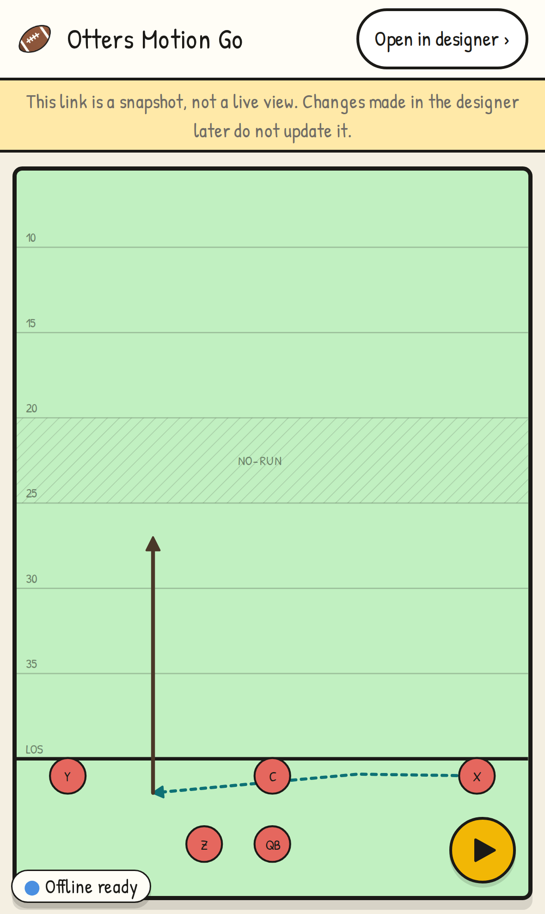

# Pre-snap motion verification

Verified against the production webpack build on 2026-09-30.

- Lint and TypeScript: passed.
- Existing unit suite: 254 passed, 7 Redis integration tests skipped (no disposable Redis service).
- Motion, custom-route, playback and phone-palette journeys: 40 passed across Chromium desktop, Pixel 7, iPhone 15 and iPad emulation.
- Final motion-to-route join adjustment: all 12 motion journeys passed again.
- Production build: passed with `bun run build --webpack`. This environment blocked Turbopack's worker port; Playwright's CDN browser archive was unavailable, so the local journeys used npm-distributed Chromium via `PLAYWRIGHT_CHROMIUM_EXECUTABLE_PATH`. CI retains the repository's normal build and browser setup.

Reproduce with `bun run build && bun run test:e2e e2e/journeys/pre-snap-motion.journey.ts e2e/journeys/custom-route.journey.ts e2e/journeys/playback.journey.ts e2e/journeys/phone-palette.journey.ts --workers=2`.

After merging main's lateral-chain and team-color changes, lint, TypeScript, the production webpack build and the existing unit suite passed again. The 68 existing motion, lateral-chain, custom-route, playback, phone-palette and team-color browser journeys passed; all four new combined motion/lateral journeys passed after moving their phone waypoint clear of the floating Run button. The combined journey verifies the center keeps possession during motion, every exchange follows the snap, the motion endpoint determines the receiving spot, and saving, assignment text, Clear routes and Undo preserve both features. CI includes its screenshot and playback manifest in `pre-snap-motion`.

Reproduce the combined checks with `bun run build && bun run test:e2e e2e/journeys/motion-lateral-chain.journey.ts e2e/journeys/lateral-chain.journey.ts e2e/journeys/pre-snap-motion.journey.ts --workers=2`.

The screenshots use only the fictional Otters fixture. Phone and tablet profiles emulate their viewports in Chromium; real Safari and hardware are outside these checks. CI uploads the repeatable screenshots, playback manifest and exported play JSON as `pre-snap-motion`.

