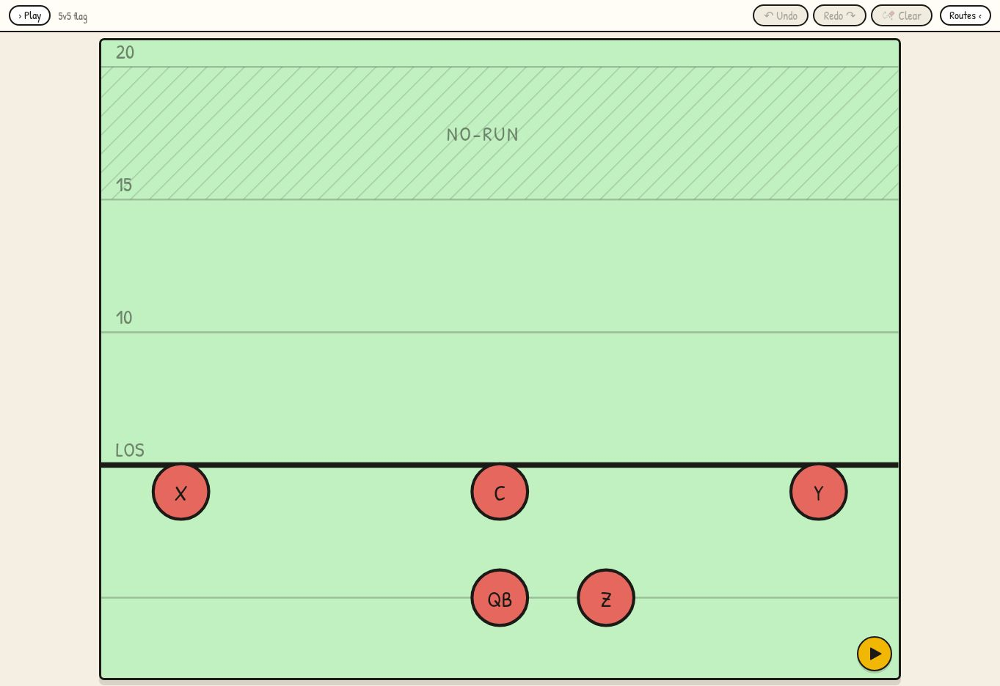
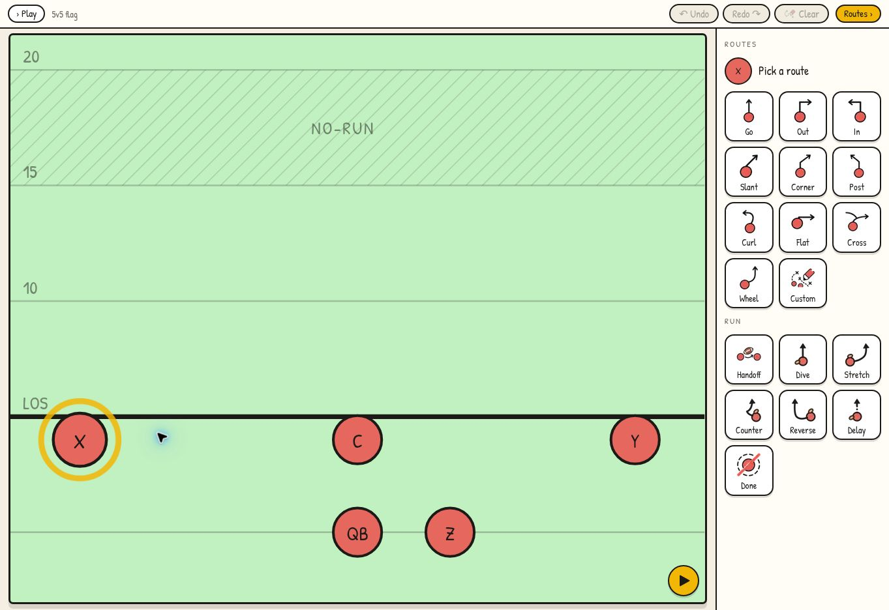
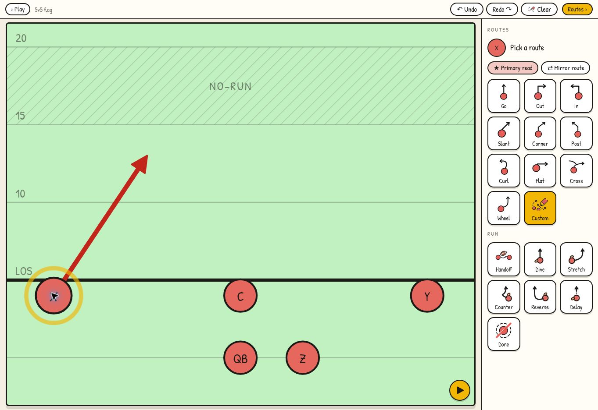
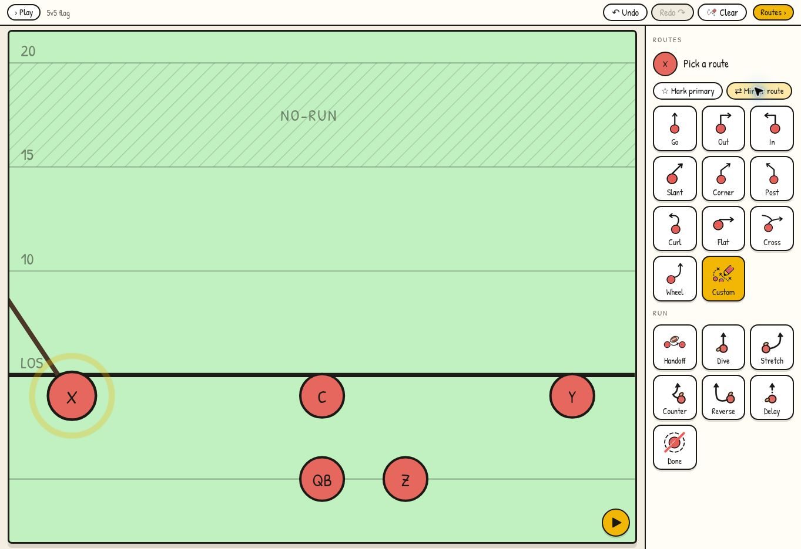
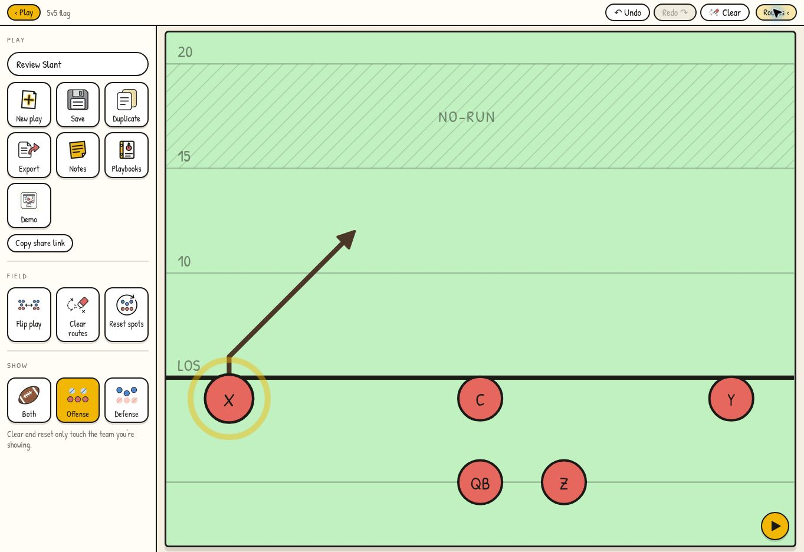
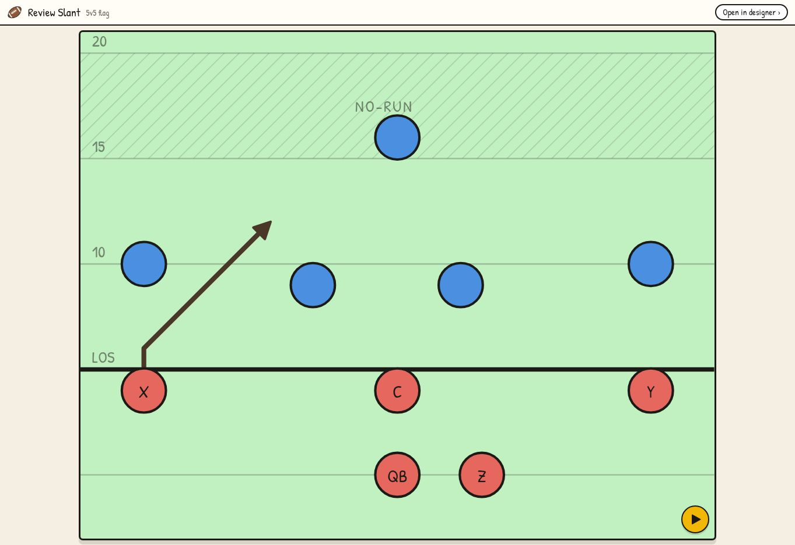
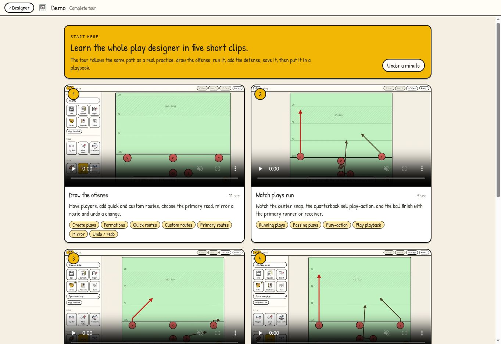

# App review evidence — 2026-09-08

Captured from https://arc-play-flag.vercel.app in desktop Chromium at 1363 × 936. Screenshots are unaltered; annotations appear below and in the linked GitHub issues. All play content is fictional review data. This branch holds review evidence only and does not need deployment.

Review baseline: `4a9d33ca6877f845c6abaed04897e7361e34486c`.

## Initial designer

1. Top-left Play button: the collapsed sidebar hides the Demo entry and play name.
2. Field: no visible first-use instruction in this state.
3. Bottom-right yellow button starts playback; a short first-use explanation would clarify the journey.

## Custom route

1. Right palette: Custom starts drawing.
2. Lower-right Done tile: currently clears selection/draft; it is not an explicit Finish Route action.
3. The DOM instruction says “Tap waypoints on the field · double-tap to finish.” The visible screenshot was captured before that transient hint appeared; it is not evidence that the hint is permanently absent.

## Primary metadata regression

1. Upper-right “★ Primary read” is selected.
2. X’s custom route is red.

1. The same control now says “☆ Mark primary,” although only Mirror route was clicked.
2. The route is now brown and extends left off the field. The primary designation was lost.

## Sharing view mismatch

1. Left Show group: Offense is selected.
2. The field contains five red offensive players.
3. Copy share link has no explicit visibility choice.

1. The shared Review Slant contains five additional blue defenders.
2. There is no visibility control in the shared view.

## Demo readability

1. “Under a minute” covers five chapters.
2. The first chapter advertises multiple separate operations in 11 seconds.
3. Full-screen recordings are scaled into cards, making the recorded controls small.
4. The recording’s sidebar differs from the current designer (New play is now a tile).

These screenshots illustrate visible behavior and product findings. Storage failure, import validation, undo document identity, and service-worker findings are backed by code/reproduction details in their issues, not by screenshots of simulated UI states.
